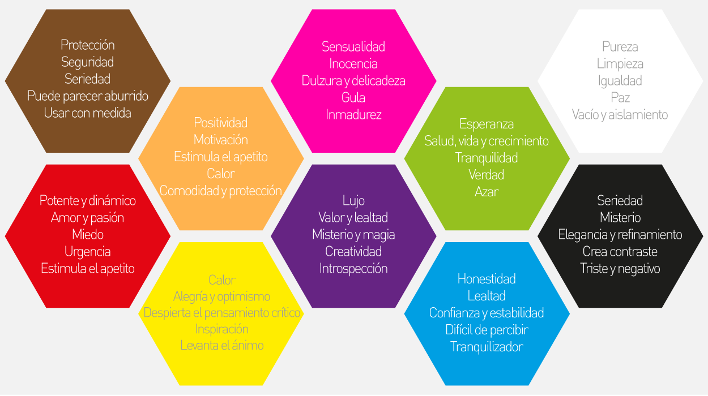
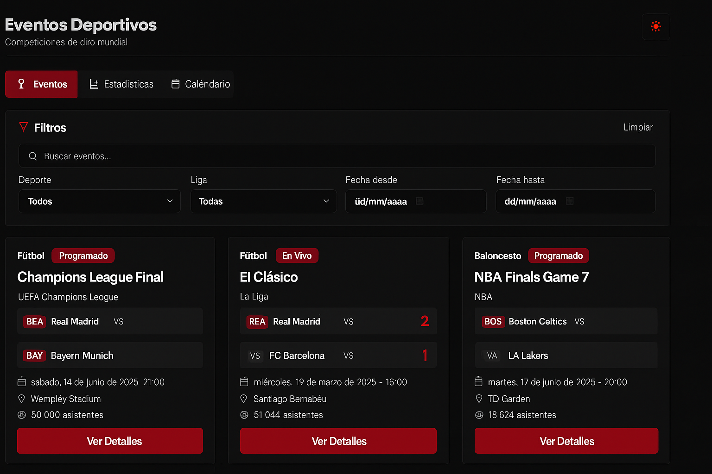
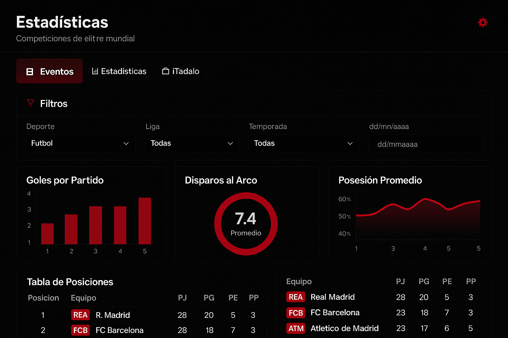
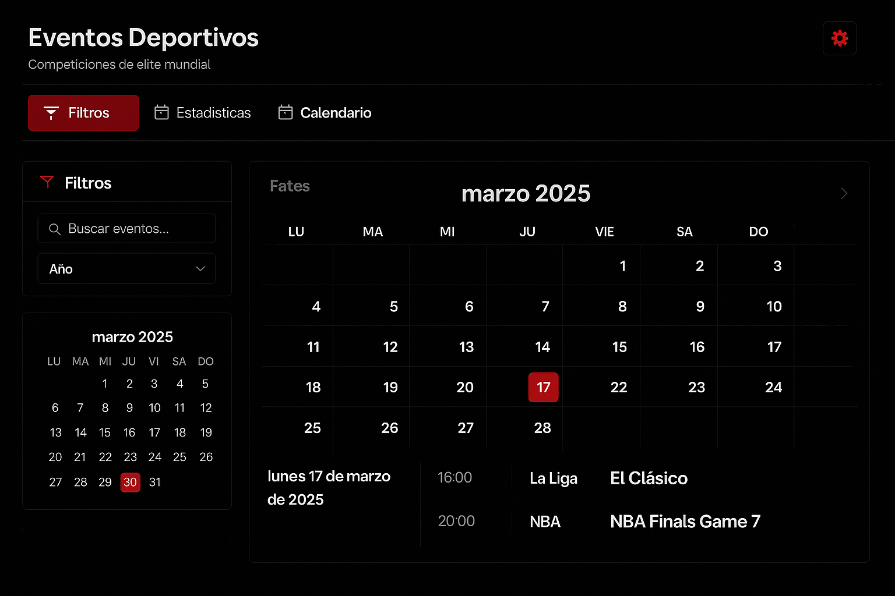
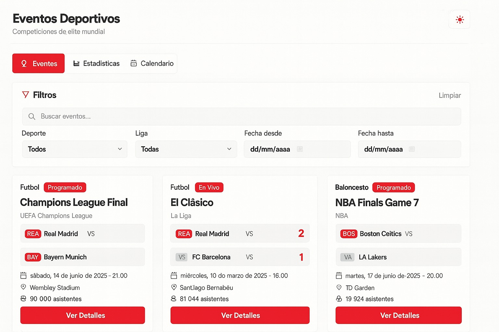
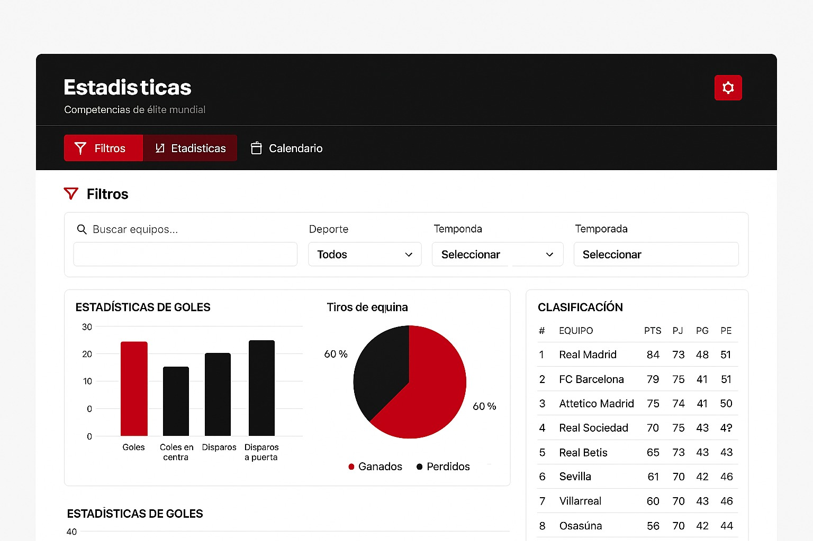
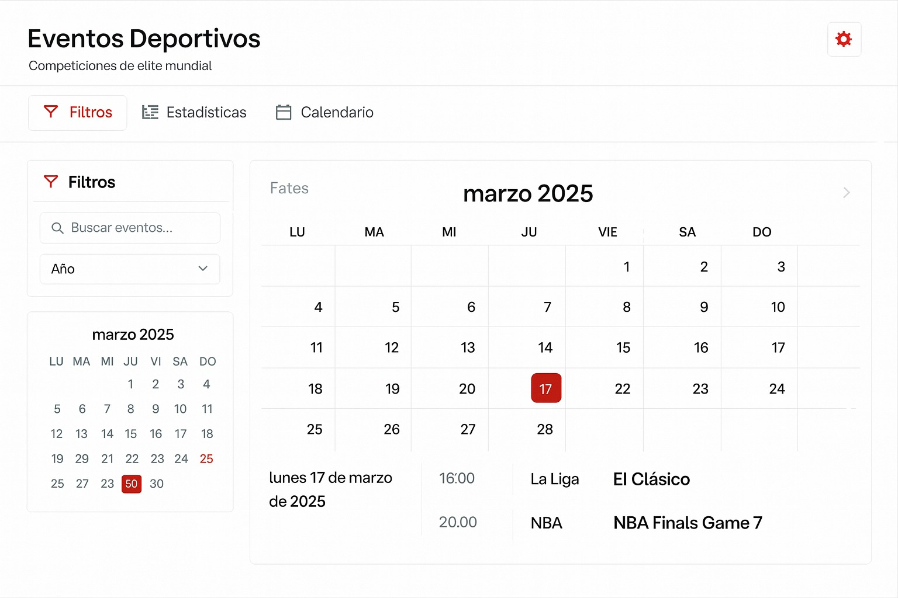

# Proyecto1-Desarrollo-web

### Integrantes
- Mariela Mejía Gutiérrez - 201373
- Samuel Rodrigo Orduña Ferreira - 207739
- Luis Eduardo Suarez Arroyo - 202717
- Carlos Lugo Torres - 207647

## Proyecto elegido
El proyecto elegido fue <strong>página de eventos deportivos</strong> la cual está basada en un sitio que muestre eventos deportivos como partidos, torneos, competencias, etc donde se incluya información general, calendario y estadísticas.

Las características técnicas de la página son las siguientes:
- Listado de eventos
- Tema claro/oscuro persistente
- API de resultados deportivos
- Gráficas con rendimiento o asistencia por equipo

### Objetivo
El objetivo del proyecto es incorporar los temas vistos en clase y reforzar las habilidades adquiridas. Específicamente, se busca incorporar temas como:
- Responsividad de una página web usando Bootstrap 5.3.8
- Manejo de APIs mediante fetch
- Manejo de visualización de datos
- Aplicar los fundamentos de HTML semántico y la estructura de documentación 
- Programación de interactividad mediante el uso de JavaScript

# Proceso de elaboración del diseño (frontend)
El proceso del diseño se inició eligiendo los colores que se usarían en la página web. Para ello, se investigó sobre la psicología de los colores, pues buscamos que nuestra página sea atractiva para los aficionados del deporte. 

Basándonos en la siguiente imagen, se eligieron los colores rojo, blanco y negro.

    

Justificación de la decisión: 
- <strong>Rojo:</strong> Es un color potente y dinámico que proyecta pasión y urgencia. Se usó para incentivar la pasión de los fanáticos de los deportes y fomentar la urgencia de consultar los calendarios y resultados de los eventos más esperados. Además, el rojo tiene la capacidadad de destacar elementos clave en nuestro diseño, como tipo de deporte o botones relevantes, guiando la atención del usuario a la información de interés. 
- <strong>Blanco:</strong> Este color se eligió con el fin de representar la limpieza y lograr una visión ordenada y amigable a la vista de los usuarios. El blanco también actúa como un espacio de respiro entre elementos más intensos, equilibrando la composición y reforzando la accesibilidad del sitio.
- <strong>Negro:</strong> Representa la elegancia, refinamiento y seriedad. Se utilizó para dotar a la página de un tono profesional y sofisticado, acorde con la naturaleza de los eventos deportivos de alto nivel. 

Una vez eligiendo los colores, pasamos al diseño gráfico de la interfaz. Para ello, nos auxiliamos de ChatGPT para la creación de una interfaz que fuera visualmente atractiva y ordenada (NOTA: No se utilizó para la elaboración del código, únicamente para generar una foto sobre cómo queríamos los diseños. Evidencia de la conversación: https://chatgpt.com/share/69015248-cadc-8001-9525-db077cb875ee). 

<strong>Los diseños de inspiración (en modo oscuro) fueron los siguientes:</strong>

Inspiración eventos (pantalla principal)

    

Inspiración estadísticas

    

Inspiración calendario

    

<strong>Los diseños de inspiración (en modo claro) fueron los siguientes:</strong>

Inspiración eventos (pantalla principal)

    

Inspiración estadísticas

    

Inspiración calendario

    

## Proceso elaboración eventos
### Estructura general
- Encabezado con título, subtítulo y un botón de alternancia de tema (luna/sol) que permite cambiar entre modo claro y oscuro.  
- Barra de pestañas superiores (Eventos, Estadísticas, Calendario) con la pestaña de Eventos activa para indicar la sección actual.  
- Bloque de filtros con:
  - Buscador general.  
  - Selects dependientes (Deporte → Liga).  
  - Campos de fecha (“Desde” / “Hasta”).  
  - Botones de Buscar y Limpiar.  
- Zona principal: grid de tarjetas (cards) que muestran los eventos con detalles visuales:
  - Nombre del evento, estado (Programado / En vivo / Finalizado).  
  - Equipos o competidores, marcador (si aplica).  
  - Fecha, sede y número de asistentes.  
  - Botón de acción “Ver Detalles”.  

### Componentes utilizados

#### Bootstrap 5.3.8
- Sistema de grillas responsive (row, col) para disposición automática en distintas resoluciones.  
- Componentes card, input-group, form-select, btn-group y utilidades de color (bg-body, text-body, border-secondary).  
- Uso de clases rounded-4, p-3, my-4 para consistencia visual y accesibilidad.  

#### Bootstrap Icons
- Íconos representativos y funcionales:
  - bi-funnel-fill → filtros.  
  - bi-calendar-event → fechas.  
  - bi-geo-alt → ubicaciones.  
  - bi-people → asistentes.  
  - bi-search → búsqueda.  

### JavaScript (funcionalidad dinámica)
- Carga inicial de datos (API).  
- Validación de fechas con formato dd/mm/aaaa usando expresiones regulares.  
- Filtro centralizado que combina búsqueda, deporte, liga y rango de fechas.  

### Comportamiento del tema (claro / oscuro)
- Si no existe preferencia guardada en localStorage, se activa modo oscuro por defecto.  
- Botón con ícono de luna/sol alterna entre los modos y actualiza el atributo data-bs-theme del documento.  
- Preferencia persistente en futuras sesiones mediante localStorage.  

### Retos 
- Validación correcta de fechas: implementación de parseDMY() y setValidity() con feedback visual.  
- Sincronización del tema con otras secciones: reutilización del script ClaroObscuro.js compartido con otras vistas.   

## Proceso elaboración estadísticas
### Estructura general
- Encabezado con título y subtítulo y un botón de tema (luna/sol) que alterna entre claro y oscuro.
- Pestañas superiores (Eventos, Estadísticas, Calendario) con la pestaña de Estadísticas activa para reforzar la navegación (que el usuario sepa en qué pestaña está).
- Bloque de filtros con buscador y selects de Deporte, Competición y Temporada. Se utilizaron input groups y form-select de Bootstrap para uniformidad y accesibilidad.
- Panel principal dividido en dos columnas:
    - Columna izquierda: gráfica de barras “Estadísticas de goles” (goles, en contra, disparos, a puerta) y gráfica de pastel “Tiros de esquina”.
    - Columna derecha: tabla de clasificación con columnas (#, Equipo, PTS, PJ, PG, PE) y acción “Ver tabla completa”.

### Componentes 
- Bootstrap 5.3.8: espaciados, botones, formularios y utilidades responsivas.
- Chart.js 4:
    - Barra para comparativos cuantitativos.
    - Gráfica de pastel para proporciones.
    - Colores de los charts ligados a variables CSS para que cambien automáticamente con el tema.
- JavaScript:
    - Toggle de tema (claro/oscuro) con persistencia en localStorage.
    - Reconstrucción de gráficas al cambiar de tema para respetar la paleta activa (destrucción/creación controlada de instancias Chart.js).

### Responsividad
- Diseño mobile-first con col-12, col-sm-*, col-lg-* para asegurar buena lectura en pantallas pequeñas y grandes.
- Iconografía con Bootstrap Icons y textos alternativos/labels en los formularios.
- Contraste verificado para ambos modos (con el objetivo de facilitar la lectura)

### Comportamiento del tema
- Si no existe una preferencia guardada, se usa el modo oscuro (nuestro default)
- Icono para cambiar de modo cambia de luna a sol y viceversa 

### Retos 
- Sincronizar colores de Chart.js con el tema: se resolvió leyendo variables CSS (--legend, --grid, --bar-1, --bar-2) y reconstruyendo las instancias al alternar.
- Coherencia visual entre pestañas: se normalizaron paddings, radios y bordes para que Filtros/Estadísticas/Calendario compartan la misma jerarquía visual.
- Legibilidad de tabla en oscuro: se ajustaron tokens de color de celdas/encabezados y se añadió una regla específica para el texto de clasificación.

## Proceso elaboración calendario

### Estructura general
- Botón de tema (luna/sol) en la navbar que alterna entre modo claro y oscuro.
- Controles de navegación del calendario:
    - Flechas para cambiar entre meses.
    - Título central con mes y año actual ("octubre 2025").
    - Botón de actualización para recargar eventos desde el servidor. (Se puede usar el botón para observar actualizaciones en los eventos)
- Panel principal dividido en dos secciones:
    - Tabla de calendario con celda por día que se pueden seleccionar para ver detalles de los eventos de ese día.
    - Sección que muestra los detalles de los eventos en ese día.

### Componentes
- Bootstrap 5.3.8: grid system, botones, tablas y utilidades responsivas para el layout.
- Bootstrap Icons: iconos de flechas y actualizar.
- Tabla calendario personalizada:
    - Celdas con tamaño fijo (40x60px) y posición relativa para indicadores visuales.
    - Punto rojo en esquina superior derecha de la celda delcalendario cuando hay eventos programados en el mes mostrado.
    - Clases dinámicas: `.today` (un borde más grueso para día actual), `.selected` (un fondo rojo para el día seleccionado).
- JavaScript:
    - Comunicación con API REST (FastAPI en `localhost:8000`) mediante `fetch()`.
    - Estado reactivo con objeto `state` que mantiene año, mes, datos del calendario y fecha seleccionada.
    - Renderizado dinámico del calendario calculando día de inicio de semana y distribuyendo eventos en celdas.

### Responsividad
- Diseño mobile-first con `.table-responsive` para scroll horizontal en pantallas pequeñas.
- Contenedor con clase `.container` de Bootstrap para márgenes adaptativos.
- Truncamiento de texto en eventos con `text-overflow: ellipsis` para mantener diseño compacto.

### Comportamiento del tema
- Variables CSS de Bootstrap se ajustan automáticamente al tema activo mediante pero el default es oscuro.
- Iconos y colores de contraste se adaptan usando variables CSS que se usan en los otros apartados de la página.

### Retos
- Alineación del calendario calcular correctamente el día de inicio considerando que JavaScript usa Domingo=0 pero la tabla muestra Lunes como primer día (solución: `(startDate.getDay() + 6) % 7`).
- Evitar conflictos de eventos con celdas y evenetos, se lucion con eluso de `stopPropagation()` evitando activaciones anidadas.
- Datos faltantes en eventos, esto se soluciona al agregar metodos de renderizado dinamico que se adecuan a los datos que hay del evento.
- No hay sincronización entre el día seleccionado en el calendario y la sección de detalles, esto se trato con el uso de `state` para mantener coherencia entre lo que se muetsra en calendario y en el panel de detalles.

# Proceso de elaboración del funcionamiento (backend)
