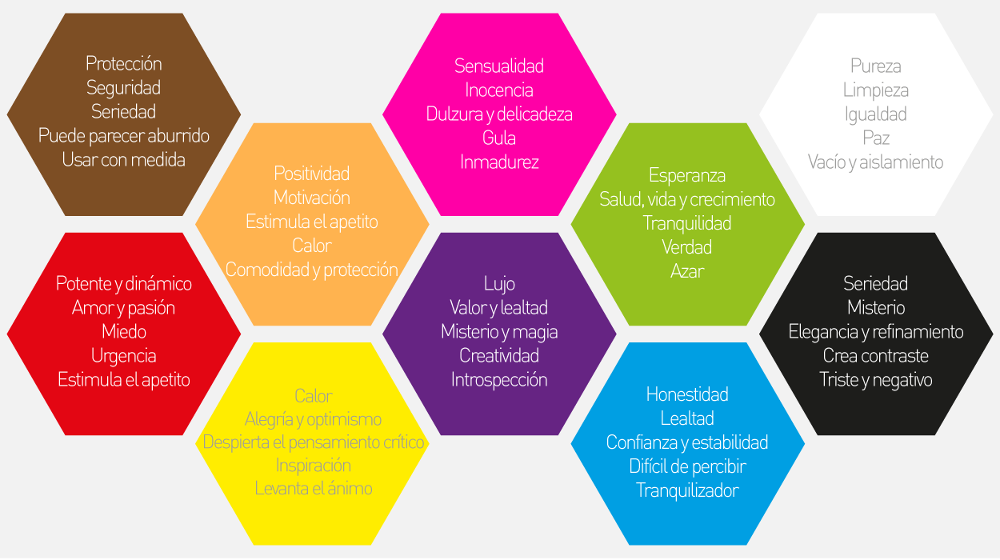

# Proyecto1-Desarrollo-web

### Integrantes
Mariela Mejía Gutiérrez - 201373

Samuel Rodrigo Orduña Ferreira - 207739

Luis Eduardo Suarez Arroyo - 202717

Carlos Lugo Torres - 207647

## Proyecto elegido
El proyecto elegido fue <strong>página de eventos deportivos</strong> la cual está basada en un sitio que muestre eventos deportivos como partidos, torneos, competencias, etc donde se incluya información general, calendario y estadísticas.

Las características técnicas de la página son las siguientes:
• Listado de eventos.
• Tema claro/oscuro persistente.
• API de resultados deportivos.
• Gráficas con rendimiento o asistencia por equipo

### Objetivo

# Proceso de elaboración del diseño
El proceso del diseño se inició eligiendo los colores que se usarían en la página web. Para ello, se investigó sobre la psicología de los colores, pues buscamos que nuestra página sea atractiva para los aficionados del deporte. 
Basándonos en la siguiente imagen, se eligieron los colores rojo, blanco y negro.

Justificación de la decisión: 
- Rojo: Es un color potente y dinámico que proyecta pasión y urgencia. Se usó para incentivar la pasión de los fanáticos de los deportes y fomentar la urgencia de consultar los calendarios y resultados de los eventos más esperados. Además, el rojo tiene la capacidadad de destacar elementos clave en nuestro diseño, como tipo de deporte o botones relevantes, guiando la atención del usuario a la información de interés. 
- Blanco: Este color se eligió con el fin de representar la limpieza y lograr una visión ordenada y amigable a la vista de los usuarios. El blanco también actúa como un espacio de respiro entre elementos más intensos, equilibrando la composición y reforzando la accesibilidad del sitio.
- Negro: Representa la elegancia, refinamiento y seriedad. Se utilizó para dotar a la página de un tono profesional y sofisticado, acorde con la naturaleza de los eventos deportivos de alto nivel. 

# Proceso de elaboración del funcionamiento
